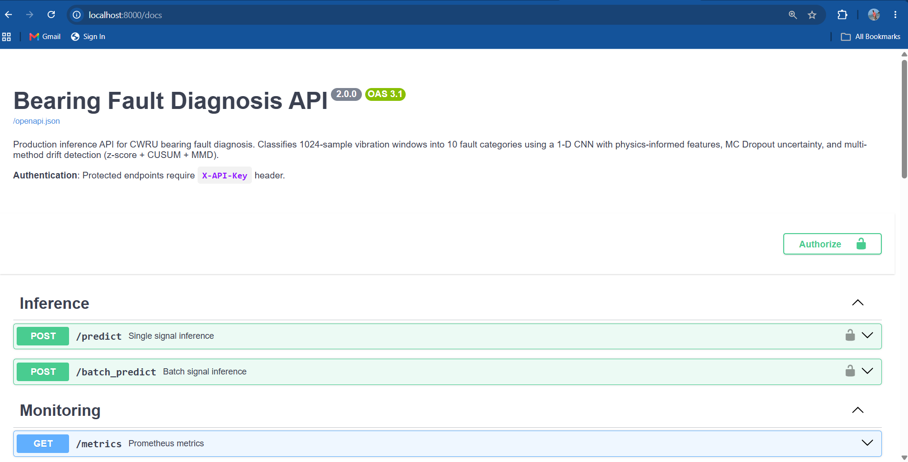
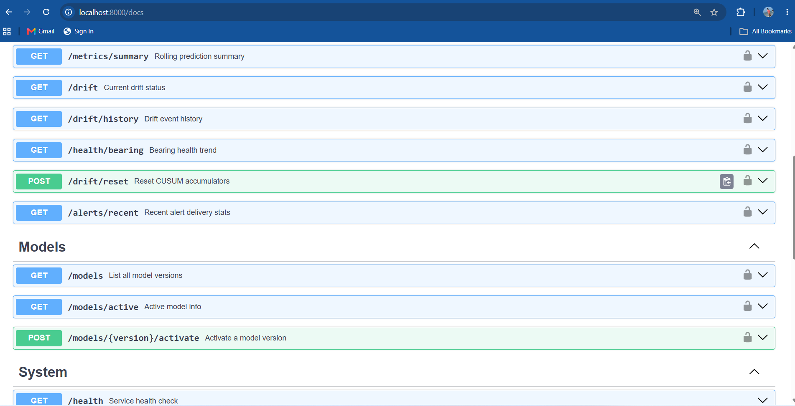
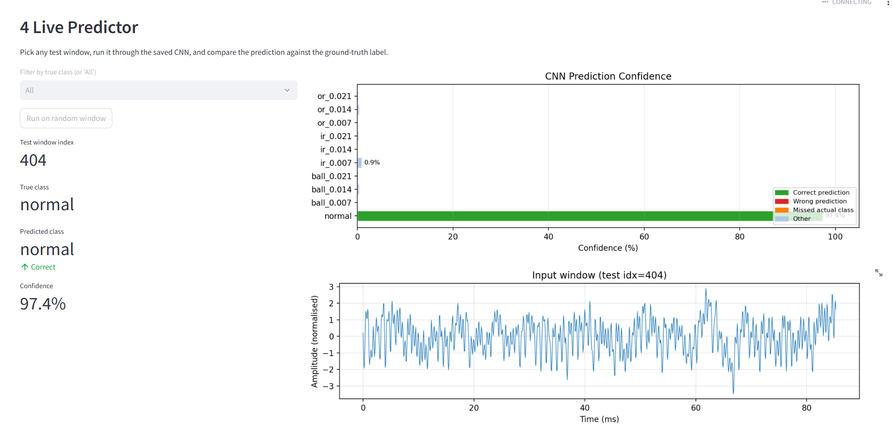
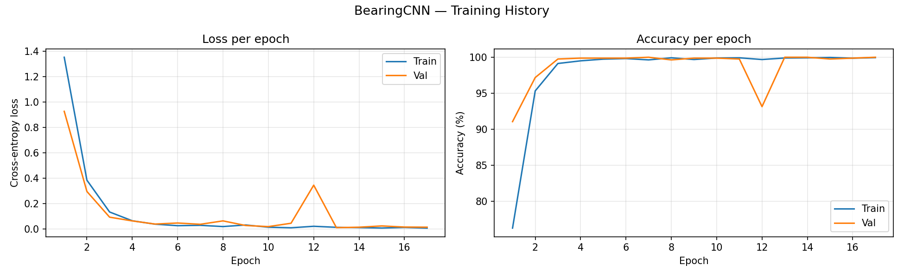

# Bearing Fault Diagnosis — Production ML System


A production-grade predictive-maintenance system that classifies rolling-element
bearing faults from raw vibration signals. Combines a 1-D CNN with **physics-informed
features** (bearing defect frequencies), **calibrated uncertainty** (MC Dropout),
**multi-method drift detection** (z-score + CUSUM + MMD), and a full **MLOps stack**
(PostgreSQL persistence, Prometheus/Grafana monitoring, CI validation gate, Docker).

Built to the engineering standard expected by industrial-AI teams
(Augury, Siemens, Honeywell, SKF).

---

## Key Results

| Evaluation | Accuracy |
|---|---|
| Same-condition (clean CWRU benchmark) | 100% |
| Sensor placement shift simulation | 95.47% |
| Noise robustness at 15dB SNR | ~86% |
| Severity generalization (unseen fault size) | 66.71% |

- p95 inference latency < 50ms
- 62 passing tests
- Full MLOps stack: CUSUM drift detection, PostgreSQL persistence, Prometheus monitoring, GitHub Actions CI/CD

---

## Dashboard & API Preview


*Production FastAPI v2.0 — API key authentication, single and batch inference endpoints*


*12 endpoints across Inference, Monitoring, Model Management, and System*


*Live predictor — CNN classifies real test windows with per-class confidence scores*


*1D-CNN training convergence — loss and accuracy across epochs with early stopping*

---

## Why this is more than a classifier

Most bearing-fault demos report "100% on CWRU" and stop there. That number is real
**only on clean, same-condition lab data**. This system reports the **honest accuracy
story** and is built like a deployable service, not a notebook.

| Capability | What it does | File |
|---|---|---|
| **Physics features** | Computes BPFO/BPFI/BSF/FTF defect frequencies and band energy per the SKF 6205 geometry | `src/ml/physics_features.py` |
| **Uncertainty** | MC Dropout replaces overconfident softmax with calibrated std + CI | `src/ml/uncertainty.py` |
| **Dual-backend inference** | PyTorch primary, ONNX fallback for edge, with latency percentiles | `src/ml/inference_engine.py` |
| **Drift detection** | z-score (per-sample) + CUSUM (sequential) + MMD (batch) with severity levels | `src/monitoring/drift_detector.py` |
| **Persistence** | Every prediction + drift event stored in PostgreSQL (async SQLAlchemy) | `src/db/` |
| **Observability** | Prometheus metrics + pre-built Grafana dashboard + webhook alerting | `src/monitoring/` |
| **Validation gate** | Pre-deploy checks (accuracy, latency, ONNX parity) wired into CI | `src/evaluation/model_validator.py` |

---

## Architecture

```
                         ┌──────────────────────────────────────────┐
   Vibration signal ───► │  FastAPI  (auth, correlation-id, logging) │
   (1024 samples)        └───────────────┬──────────────────────────┘
                                         │
              ┌──────────────────────────┼───────────────────────────┐
              ▼                          ▼                            ▼
     ┌─────────────────┐      ┌────────────────────┐      ┌────────────────────┐
     │ InferenceEngine │      │ PhysicsFeatures(19)│      │   DriftDetector    │
     │ PyTorch / ONNX  │      │ BPFO/BPFI/BSF/FTF  │      │ zscore+CUSUM+MMD   │
     │ + MC Dropout    │      │ + health index     │      │ NONE/WARN/CRITICAL │
     └────────┬────────┘      └─────────┬──────────┘      └─────────┬──────────┘
              │                         │                           │
              └─────────────┬───────────┴───────────────┬───────────┘
                            ▼                            ▼
                 ┌────────────────────┐       ┌────────────────────┐
                 │  PostgreSQL (async)│       │ Prometheus metrics │
                 │  predictions /     │       │  → Grafana / alerts│
                 │  drift / registry  │       │  → webhook alerter │
                 └────────────────────┘       └────────────────────┘
```

---

## Bearing physics

Bearing: **SKF 6205-2RS JEM** (CWRU Drive End) — 9 balls, ball Ø 0.3126 in,
pitch Ø 1.537 in, contact angle 0°, sampled at 12 kHz.

Characteristic defect frequencies (shaft speed `RPM`, `α` = contact angle):

```
BPFO = (Nb/2) · (1 − Bd/Pd · cos α) · RPM/60      (outer race)
BPFI = (Nb/2) · (1 + Bd/Pd · cos α) · RPM/60      (inner race)
BSF  = (Pd/2Bd) · (1 − (Bd/Pd · cos α)²) · RPM/60 (ball spin)
FTF  = (1/2) · (1 − Bd/Pd · cos α) · RPM/60        (cage)
```

At **1797 RPM** this yields BPFO ≈ **107.4 Hz**, BPFI ≈ **162.2 Hz**,
BSF ≈ **70.6 Hz**, FTF ≈ **11.9 Hz** — matching CWRU published values
(unit-tested in `tests/unit/test_physics_features.py`).

---

## Performance — the honest story

All numbers below are reproducible via the scripts in `src/evaluation/`.

### Same-condition (clean CWRU test set)

| Model | Test Accuracy |
|---|---|
| Random Forest | 87.38% |
| SVM (RBF) | 85.78% |
| **1-D CNN** | **100.00%** |

### Generalisation — three tests of increasing rigour

`python -m src.evaluation.cross_condition_eval`

The single number that matters here is **not** 100%. Below is the honest spread,
from the weakest test (which everyone quotes) to the ones that actually probe
whether the model would survive deployment.

**TEST 1 — RPM cross-condition (weak, do not oversell).**

| Train conditions | Test (held-out RPM) | Accuracy |
|---|---|---|
| 3 of {1797, 1772, 1750, 1730} | unseen 4th | 99.99% mean |

This looks impressive but isn't: the four speeds span only **3.7%** (1797→1730
RPM) on the *same rig, sensor, and mounting*, so defect frequencies barely move
and the model generalises trivially. A real cross-condition test would need a
different machine, sensor placement, and load path — which CWRU structurally
cannot provide.

**TEST 2 — Unseen fault severity (meaningful).** Train a fault-*type* classifier
on **only small 0.007″ faults + normal**, then test on **unseen severities**:

| Test severity | Fault-type accuracy |
|---|---|
| 0.007″ (seen — sanity) | 100.0% |
| 0.014″ (interpolation) | 41.4% |
| **0.021″ (unseen — the real test)** | **66.7%** |

The model never saw these damage levels. The drop to **66.7%** is the honest cost
of severity extrapolation — and note that medium (0.014″) is *harder* than large
(0.021″), because large faults have stronger, clearer impulse signatures.

**TEST 3 — Simulated sensor mismatch (domain shift).**

| Perturbation | Accuracy | Why |
|---|---|---|
| Affine gain ±20% + offset ±0.1 | 100.0% | model is invariant — input `BatchNorm` removes global gain/offset |
| Freq-response, mild (±3 dB tilt + 4 dB resonance) | 99.8% | — |
| **Freq-response, moderate (±6 dB + 8 dB)** | **95.5%** | realistic placement change |
| Freq-response, strong (±9 dB + 12 dB) | 84.4% | severe mounting mismatch |

Pure gain/offset doesn't move the needle because the CNN's first layer is
`Conv1d → BatchNorm1d`, which normalises exactly those away. A *frequency-selective*
transform (different sensor bandwidth / mounting resonance) is what BatchNorm
cannot undo — and accuracy falls to **95.5%** (moderate) / **84.4%** (strong).

### Noise robustness (AWGN at decreasing SNR)

`python -m src.evaluation.noise_robustness`

| SNR | Accuracy | Notes |
|---|---|---|
| clean | 100.0% | baseline |
| 30 dB | 100.0% | imperceptible noise |
| 20 dB | 98.2% | typical sensor floor |
| **15 dB** | **86.2%** | **← accuracy drops below 90%** |
| 10 dB | 59.9% | realistic industrial noise — needs filtering |
| 5 dB | 12.0% | severe |

**Deployment takeaway:** this model is reliable down to ~**15 dB SNR**. Below that,
incoming signals need pre-filtering (envelope/band-pass) before inference. That is
the number an industrial-AI reviewer actually wants to see.

### Bottom line

| Scenario | Accuracy | Verdict |
|---|---|---|
| Same-condition CWRU (clean) | **100%** | benchmark ceiling — expected, not impressive on its own |
| RPM cross-condition | 99.99% | weak test (3.7% speed change, same rig) |
| Sensor freq-response mismatch (moderate) | **95.5%** | holds up under realistic placement change |
| Noise @ 15 dB SNR | 86.2% | usable floor; filter below this |
| **Unseen fault severity (.007″→.021″)** | **66.7%** | the real generalisation limit — quote this |
| Affine gain/offset | 100% | invariant by design (input BatchNorm) |

The one-sentence honest story:
**"Near-perfect on same-condition CWRU, ~95% under a realistic sensor-placement
shift, but only ~67% on a fault severity it was never trained on — severity
extrapolation, not operating condition, is the real generalisation gap."**

---

## Quick start

```bash
# Clone
git clone https://github.com/Narendra1112/bearing-fault-diagnosis.git
cd bearing-fault-diagnosis

# Configure (optional — defaults work for local dev)
cp .env.example .env

# Full stack: API + Postgres + Redis + Prometheus + Grafana + MLflow
docker compose -f docker/docker-compose.yml up --build
```

| Service | URL |
|---|---|
| API (Swagger) | http://localhost:8000/docs |
| Prometheus | http://localhost:9090 |
| Grafana (admin/admin) | http://localhost:3000 |
| MLflow | http://localhost:5000 |

### Local dev (no Docker)

```bash
python -m venv venv && venv\Scripts\activate     # Windows
pip install -r requirements.txt
uvicorn src.api.main:app --reload --port 8000
```

---

## API

Protected endpoints require an `X-API-Key` header (set `API_KEY` in `.env`).

| Endpoint | Method | Auth | Description |
|---|---|---|---|
| `/health` | GET | — | Service + model status |
| `/classes` | GET | — | 10 fault class names |
| `/metrics` | GET | — | Prometheus exposition |
| `/predict` | POST | ✓ | Single inference: class, uncertainty, physics, drift |
| `/batch_predict` | POST | ✓ | Up to 32 signals in parallel |
| `/metrics/summary` | GET | ✓ | Rolling stats from DB |
| `/drift` | GET | ✓ | Current drift status + CUSUM values |
| `/drift/history` | GET | ✓ | Drift events (last 24 h) |
| `/drift/reset` | POST | ✓ | Reset CUSUM accumulators |
| `/health/bearing` | GET | ✓ | Bearing health trend |
| `/alerts/recent` | GET | ✓ | Webhook delivery stats |
| `/models` | GET | ✓ | Model registry |
| `/models/active` | GET | ✓ | Active model + live latency |
| `/models/{version}/activate` | POST | ✓ | Switch active version |

### Example

```bash
curl -X POST http://localhost:8000/predict \
  -H "X-API-Key: $API_KEY" \
  -H "Content-Type: application/json" \
  -d '{"signal": [/* 1024 z-score normalised samples */]}'
```

```jsonc
{
  "predicted_class": "or_0.007",
  "confidence": 0.969,
  "uncertainty": { "uncertainty_std": 0.011, "is_uncertain": false },
  "physics":     { "bearing_health_index": 0.94, "envelope_kurtosis": 5.2 },
  "drift_warning": false,
  "drift_severity": "NONE",
  "backend": "pytorch"
}
```

---

## MLOps stack

```
 Code push ─► GitHub Actions CI ─► pytest (unit + integration)
                                 ─► model_validator gate (acc / latency / ONNX parity)
                                 ─► docker build
                                          │
 Runtime ─► FastAPI ─► Prometheus scrape (/metrics every 15s)
                    ─► Grafana dashboard (latency, drift, health, class dist.)
                    ─► Alert rules (drift>10%, p95>500ms, health<0.3)
                    ─► PostgreSQL (every prediction + drift event persisted)
```

- **Validation gate** (`src/evaluation/model_validator.py`) blocks deploy unless:
  accuracy ≥ 95%, per-class ≥ 85%, p95 latency ≤ 50 ms, no NaN/Inf, ONNX matches
  PyTorch within 1e-4. Current model: **PASS (5/5)**.
- **Load tested** with Locust (`tests/load/locustfile.py`) — target p95 < 200 ms
  at 50 concurrent users.

---

## Testing

```bash
pytest tests/unit/          # 32 tests — physics formulas, drift methods (no data needed)
pytest tests/integration/   # 30 tests — full API via TestClient
pytest tests/               # 62 tests total
```

```bash
# Evaluation reports → outputs/reports/*.json
python -m src.evaluation.cross_condition_eval
python -m src.evaluation.noise_robustness
python -m src.evaluation.model_validator
```

---

## Project structure

```
src/
├── core/          config (pydantic-settings) · structured JSON logger · exceptions
├── ml/            physics_features · inference_engine (PyTorch/ONNX) · uncertainty
├── db/            SQLAlchemy models · async session · CRUD
├── monitoring/    drift_detector (zscore/CUSUM/MMD) · Prometheus metrics · alerting
├── api/
│   ├── middleware/  API-key auth
│   ├── routes/      inference · monitoring · models
│   └── main.py      app factory, lifespan, correlation-id middleware
└── evaluation/    cross_condition · noise_robustness · model_validator
tests/             unit · integration · load (Locust)
docker/            Dockerfile · docker-compose (6 services) · prometheus · grafana
grafana/dashboards bearing_monitoring.json
.github/workflows  ci.yml (test → validate → build)
```

---

## Real-world applications

| Industry | Use case |
|---|---|
| Manufacturing | Predictive maintenance on spindle / conveyor motors |
| Wind energy | Gearbox & generator bearing health monitoring |
| Railways | Axle bearing fault detection from on-board sensors |
| Aerospace | Engine bearing diagnostics during ground tests |
| HVAC / Data centers | Compressor bearing early-fault detection |

---

## License

MIT
